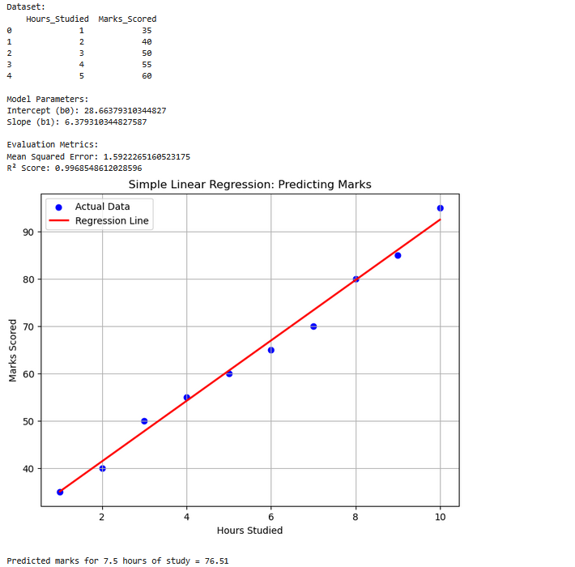

# Implementation-of-Simple-Linear-Regression-Model-for-Predicting-the-Marks-Scored

## AIM:
To write a program to predict the marks scored by a student using the simple linear regression model.

## Equipments Required:
1. Hardware – PCs
2. Anaconda – Python 3.7 Installation / Jupyter notebook

## Algorithm
STEP 1. Start the program.

STEP 2.Import the standard Libraries.

STEP 3.Set variables for assigning dataset values.

STEP 4.Import linear regression from sklearn.

STEP 5.Assign the points for representing in the graph.

STEP 6.Predict the regression for marks by using the representation of the graph.

STEP 7.End the program.

## Program:
```
/*
Program to implement the simple linear regression model for predicting the marks scored.
Developed by: NITESH BHANDARI K
RegisterNumber:  212225240101


*/


# Step 1: Import Libraries
import numpy as np
import pandas as pd
import matplotlib.pyplot as plt
from sklearn.model_selection import train_test_split
from sklearn.linear_model import LinearRegression
from sklearn.metrics import mean_squared_error, r2_score

# Step 2: Create Dataset (Hours studied vs Marks scored)
data = {
    "Hours_Studied": [1, 2, 3, 4, 5, 6, 7, 8, 9, 10],
    "Marks_Scored":  [35, 40, 50, 55, 60, 65, 70, 80, 85, 95]
}
df = pd.DataFrame(data)

# Display dataset
print("Dataset:\n", df.head())
df

# Step 3: Split into Features and Target
X = df[["Hours_Studied"]]   # Independent variable
y = df["Marks_Scored"]      # Dependent variable

# Step 4: Train-test split
X_train, X_test, y_train, y_test = train_test_split(
    X, y, test_size=0.2, random_state=42
)

# Step 5: Train Linear Regression Model
model = LinearRegression()
model.fit(X_train, y_train)

# Step 6: Predictions
y_pred = model.predict(X_test)

# Step 7: Model Evaluation
print("\nModel Parameters:")
print("Intercept (b0):", model.intercept_)
print("Slope (b1):", model.coef_[0])

print("\nEvaluation Metrics:")
print("Mean Squared Error:", mean_squared_error(y_test, y_pred))
print("R² Score:", r2_score(y_test, y_pred))

# Step 8: Visualization
plt.figure(figsize=(8,6))
plt.scatter(X, y, color='blue', label="Actual Data")
plt.plot(X, model.predict(X), color='red', linewidth=2, label="Regression Line")
plt.xlabel("Hours Studied")
plt.ylabel("Marks Scored")
plt.title("Simple Linear Regression: Predicting Marks")
plt.legend()
plt.grid(True)
plt.show()

# Step 9: Predict Marks for custom input
hours = 7.5
new_data = pd.DataFrame({"Hours_Studied": [hours]})
predicted_marks = model.predict(new_data)

print(f"\nPredicted marks for {hours} hours of study = {predicted_marks[0]:.2f}")

```

## Output:



## Result:
Thus the program to implement the simple linear regression model for predicting the marks scored is written and verified using python programming.
